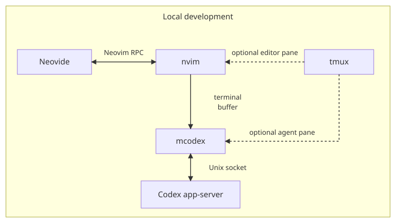
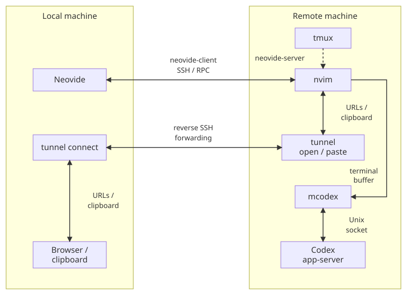

# workspace

Shared shell tools, Git worktrees, Neovim, Neovide, Codex, and tmux.
Each component runs independently and connects through workspace files,
working directories, or client/server connections.

## Setup

```sh
make setup
exec zsh -l
make help
```

Nix pins the tools; the Makefile installs configurations and agent CLIs.
Install reusable skills separately with `make skills-sync`.
Edit files here, then run the matching target: `make workspace-bin`,
`make nvim-config`, `make neovide-config`, or `make tmux-config`.

Linux uses single-user Nix for fresh installations. Run setup as your normal user;
`/nix` must already be writable by your account. Reuse existing shared installations
without changing ownership. macOS uses the Nix daemon installer. Setup keeps your
login shell without administrator access; `exec zsh -l` starts the installed shell.

## Local workspaces

From a folder containing sibling repositories, [`mkws`](bin/mkws) creates a
workspace with one Git worktree per selected repository:

```sh
mkws --name example-a --branch example-branch-a --add repo-a repo-b
mkws --name example-b --branch example-branch-b --add repo-b repo-c@example-branch-c
```

```text
<root>/
├── repo-a/
├── repo-b/
├── repo-c/
└── local_workspaces/
    ├── example-a/
    │   ├── workspace.yml
    │   ├── tech_doc/
    │   ├── repo-a/    # example-branch-a
    │   └── repo-b/    # example-branch-a
    └── example-b/
        ├── workspace.yml
        ├── tech_doc/
        ├── repo-b/    # example-branch-b
        └── repo-c/    # example-branch-c
```

Worktrees have separate working files and share history with their source repos.
`repo@branch` overrides the workspace's default branch for that repository.
`workspace.yml` records branches and repositories; `tech_doc/` holds shared notes.
`mkws resume` restores missing worktrees when the source repositories exist.

`meta-hub project` and `meta-hub repo` provide shell navigation. In Neovim,
Space is `<leader>`: `<leader>wp` picks a workspace, `<leader>wr` a repository,
and `<leader>ww` a worktree.

## Editor and agent



Neovide is the graphical UI for Neovim. Neovim runs [`mcodex`](bin/mcodex) in a
terminal buffer scoped to the working directory. `mcodex` starts or reuses the
managed Codex daemon and connects its terminal UI; without arguments it opens
the resume picker. The editor and agent work on the same saved files.

`<leader>;` toggles the agent view or sends a visual selection. Switching
repositories preserves agent terminals. Hiding the view keeps its job running;
quitting the agent terminal disconnects its UI from the separate daemon.

## tmux as the glue

tmux groups editors, agents, tests, and logs, keeping processes running across
terminal disconnects. Run `nvim` and `mcodex` in separate panes, or use Neovide
alongside them. New panes inherit the current directory. `Ctrl-b a` pins a session;
`Ctrl-b A` toggles the sidebar.

## Remote development



```sh
# Remote machine, from the workspace directory:
tmux new-session -s example-workspace
neovide-server 6666

# Local machine:
neovide-client example-host:6666

# Separate local terminal, for browser and clipboard forwarding:
tunnel connect example-host
```

The client attaches local Neovide over SSH to headless Neovim running remotely.
Files and agent jobs stay remote. Disconnecting the GUI leaves the hosted editor
available; quitting Neovim ends it. The Codex daemon has its own lifetime.
The separate [`tunnel`](bin/tunnel) connection opens remote URLs locally and
transfers copied files or images to the remote machine.
