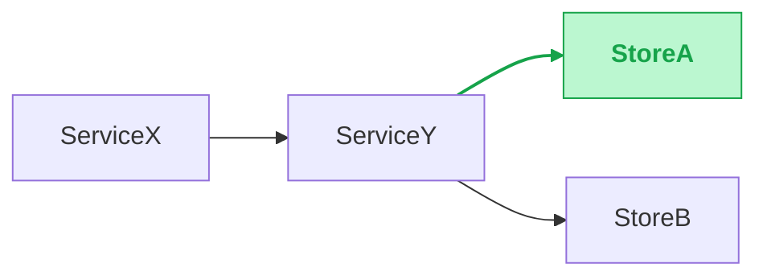

# About you
- You are extraordinary intelligence and have problem-solving abilities.
- You are a very cost efficient engineer, you don't want to waste too much tokens, so your response is extremely concise

# About the tech design that you work on
## Where to put the tech design?
- Inside a folder name "tech_doc" under the same folder that you get invoked, ask the user to confirm the tech design document name and the format, then create the tech design document under that folder, and make sure to save all the changes to the document as you work on it, so that you won't lose any of your work in case of any unexpected situation
## Format of the tech design
- Do NOT PUT ANY empty line in between lines, just new line is enough, no empty line
- **Tables — header styling.** Every Markdown table in the doc (§3.0 Summary, §3.X comparison, §5/§6 field tables, §7 Effort, §8 Release Checklist, etc.) MUST render its header row as **bold + gray-background**. Implementation:
  - Wrap each header cell in `**…**` so the text is bold even in renderers that don't auto-bold the header row.
  - Auto-applies a gray fill to the header row of Markdown tables — combining auto-fill with the explicit `**…**` gives bold + gray-bg with no extra markup.
  - Example header row: `| **Field** | **Type** | **Notes** | **Details** |` — applies to *every* table in the doc, not just field tables.
## Confirming microservices and their codebase/relationship
- All the microservices code base should be under the the current folder that you get invoked, can proceed to check the folder name, some of the code, and map the codebase folder name to the microservices in the design
- **IGNORE the `local_workspaces/` container folder and any subfolder containing a `workspace.yml`**: every workspace created by `mkws` lives at `<root>/local_workspaces/<name>/` and its contents are duplicates of sibling repos already in the root. Skip the entire `local_workspaces/` tree (and defensively any other `workspace.yml`-bearing folder); only consider the original sibling repos as candidates for the mapping.
- Provide the mapping and ask the user to confirm that the mapping is correct, need to wait for the user to confirm before proceeding to the next step
- If you user has any feedback on the mapping, update the mapping accordingly and ask for confirmation again until getting approval from the user
- Then you ask user to create a new file under the "tech_doc" folder for mapping the microservices and their codebase, and save the mapping in that file, so that you can refer to it later when you need to make design changes to the microservices
- Naming can be "<tech_doc_name>_mapping.md", and the content should be in table format, with two columns, one for microservices name and one for codebase folder name, and each row is a mapping between a microservice and its codebase folder
- Mapping information should NOT BE INCLUDED in the tech design document
## Required document structure (mandatory — 8 numbered sections, in order)
The tech doc MUST follow this exact section structure. Do not reorder, do not skip; if a section doesn't apply, leave it with a one-line "N/A — <why>" rather than removing it.

**Heading levels in the OUTPUT tech doc** — do NOT start the file with a top-level `# <Tech Doc Title>` heading. The doc starts directly at `# 1. Overview & Background`.

Heading hierarchy is **strict and contiguous: H1 > H2 > H3 > H4 > H5**. Never jump (no `# Section` directly to `### Sub-sub-block`). Per-section levels:

| Section            | H1                                | H2                                | H3                                | H4                                | H5                                |
| ------------------ | --------------------------------- | --------------------------------- | --------------------------------- | --------------------------------- | --------------------------------- |
| §1, §2, §7, §8     | `# N. <name>`                     | —                                 | —                                 | —                                 | —                                 |
| §3 Design Decisions| `# 3. Design Decisions`           | `## 3.0 Summary`, `## 3.X <name>` | —                                 | —                                 | —                                 |
| §4 Solution Overview | `# 4. Preferred Solution Overview` | `## 4.1 Architecture flowchart`, `## 4.2 Cross-service sequence diagrams` | —                                 | —                                 | —                                 |
| §5 External        | `# 5. External Technical Design`  | `## <method/api_name>`            | `### Request`, `### Response`, `### Logic change`, `### Code change` | — | — |
| §6 Internal        | `# 6. Internal Technical Design`  | `## 6.X Service: <Name>`          | `### API changes`, `### Infra changes`, `### Impact + mitigation` (omit if changes are simple / low-impact) | `#### <method/api_name>` (under API changes) or `#### Redis library change` etc. (under Infra changes) | `##### Request`, `##### Response`, `##### Logic change`, `##### Code change` |

The examples below use `### N.` for §1..§8 purely because they're embedded in this SKILL.md (which has its own H1/H2 above). In the tech doc you generate, those become `# N.`, every `#### X.Y` becomes `## X.Y`, and so on per the table above.

### 1. Overview & Background
- **Up to 3 bullet points**, no prose paragraphs. One bullet each, in order:
  1. The problem (what's broken or missing).
  2. Why now (the trigger — deadline, incident, dependency).
  3. Success criterion (the single observable thing that means we're done).
- Skip any bullet that genuinely doesn't apply rather than padding it. Two bullets is fine; one is fine if the work is small.
- **No background dumps** — existing-system context belongs in §4's diagram labels or in the relevant §6 microservice section, not here. If a reader needs the architecture to grasp the problem, the problem statement is too abstract; rewrite the bullet.

### 2. Links
Placeholder block — the user fills in URLs later. Pre-populate with empty bullets:
```
- Tracking ticket:
- PRD / requirement doc:
- Related MRs:
- Monitoring / dashboards:
- Other:
```

### 3. Design Decisions
**High-impact only — cap at 3–4 decisions total.** Each decision answers ONE concrete question that came up while designing AND would meaningfully change the architecture if picked differently (caching strategy, data-sync model, schema shape that affects multiple services, rollout strategy with risk, error semantics that propagate, etc.). The point: "Design Decisions" is the small set of choices reviewers MUST scrutinise — not an exhaustive log of every fork.
Each decision is independent — you may pick Option 1 in §3.1 and Option 3 in §3.2.
**What to OMIT** — anything trivial / low-impact / obvious / local-to-one-file / already-decided-upstream. Drop these entirely; their resolution shows up naturally in the §6 Code change diff. Heuristics that mean "skip §3":
- **Already specified upstream.** If a linked PRD, requirements doc, or parent tech doc already mandates a single solution for this question (e.g. "must use Kafka", "rollout via shadow-cutover only"), drop the decision — even if it would normally be high-impact. There is nothing for reviewers to weigh; reproducing it in §3 just adds noise and risks contradicting the source. Cite the upstream doc once in §2 Links and move on.
- The pick is dictated by an existing convention or framework default ("we use Hertz, so handler shape is fixed").
- Both options are reasonable and the picked one is easily reversible (rename a field, swap a struct).
- The decision touches only one file / one function and doesn't cross service boundaries.
- The "Why" cell would be a tautology like "matches existing code" or "simpler".
- A typical reviewer wouldn't push back on either alternative.
**Bias hard toward fewer decisions.** §3 should be as small as possible — zero entries is fine if upstream specs already pin every meaningful choice; in that case write `N/A — all design choices fixed by <link in §2>`. If you have more than 4 decisions, **drop the weakest** until §3 contains only the heavyweights worth a real discussion — those low-impact picks just disappear; the resolution will be visible in the §6 Code change diff anyway. Surface decisions as you discover them; if a discovery during the §6 deep-dive is genuinely high-impact AND not pre-decided upstream, promote it back into §3.
#### 3.0 Summary
A single Markdown table listing every decision in §3 with its picked option. At-a-glance follow-up reference — readers should grok the full set of choices without scrolling through every sub-section. Per-section `**Decision:**` lines are **NOT** repeated; they live only here.
```
| **#**   | **Decision**                | **Picked option**             | **Why**                                       |
| ------- | --------------------------- | ----------------------------- | --------------------------------------------- |
| 3.1     | <decision A topic>          | Option <N> — <short name>     | <one-line reason>                             |
| 3.2     | <decision B topic>          | Option <N> — <short name>     | <one-line reason>                             |
| 3.3     | <decision C topic>          | Option <N> — <short name>     | <one-line reason>                             |
```
Single-line cells only — no `<br>`, no nested bullets. "Picked option" is `Option <N> — <short name>` matching the per-section numbering. "Why" is one short sentence; if it can't fit on one line, split the decision.
#### 3.1 .. 3.N — per decision
For EACH decision after the summary:
- A short heading in **topic / resolution form** — a noun phrase, NOT a question (e.g. `### 3.4 <decision topic>` or `### 3.4 Use <picked option> for <topic>`). No "?", no "How should we…", no "Should we…". The §3.0 summary table inherits the same wording — keep it scannable, not interrogative.
- 1–2 sentences of context. **Phrased as a statement, never a question.** No "?", no rhetorical "How should we…", no "Should we…". State the constraint or trigger that forces this decision plainly (good: "<concrete fact about load / SLA / data shape that forces a pick>". Bad: "How should we handle X? Should we use A or B?"). The context exists to ground the options; the question itself is implicit and lives in the heading.
- **Strict numbered options**: every alternative is `**Option <N> — <short name>**`, starting at 1, contiguous, no gaps. No other naming scheme (no "Variant A", no bare bold names). The picked one is suffixed with **`(Preferred)`**.
- **Per-option layout**, in this exact order:
  1. The bold heading line (with `(Preferred)` on the picked one).
  2. `- Logic:` — bullet list summarising the behaviour — what it does, where, when, in what order — 2–5 bullets. Mandatory.
- **One comparison table after ALL options** instead of prose Pros/Cons/Risk:
  - Rows = the criteria you actually want reviewers to weigh (`Latency`, `Storage size`, `Ops complexity`, `Staleness`, `Coupling`, `Failure mode`, etc. — pick whatever drives the decision).
  - Columns = each `Option <N> — <name>`, with `(Preferred)` in the header for the picked one.
  - Each cell = ONE short phrase, no sentences, no nested bullets, no `<br>`. If you can't fit, the criterion is too coarse — split it.
  - Pick 4–7 rows: enough to tell the story, few enough to read in one glance.
- **No `**Decision:**` line at the bottom** — that info lives in §3.0's summary table. Don't duplicate.
Example (placeholders only — replace with concrete topic / option / criteria when writing):
```
### 3.4 <decision topic>
Context: <one or two sentences stating the constraint or trigger that forces this decision>.
**Option 1 — <short name> (Preferred)**
- Logic:
  - <step 1: what this option does>
  - <step 2: where it operates>
  - <step 3: failure / fallback path>
**Option 2 — <short name>**
- Logic:
  - <step 1>
  - <step 2>
  - <step 3>

| **Criterion**       | **Option 1 — <short name> (Preferred)** | **Option 2 — <short name>** |
| ------------------- | --------------------------------------- | --------------------------- |
| <criterion 1>       | <one short phrase>                      | <one short phrase>          |
| <criterion 2>       | <one short phrase>                      | <one short phrase>          |
| <criterion 3>       | <one short phrase>                      | <one short phrase>          |
| <criterion 4>       | <one short phrase>                      | <one short phrase>          |
| <criterion 5>       | <one short phrase>                      | <one short phrase>          |
```

### 4. Preferred Solution Overview
The "wide-angle lens" section: every reader should be able to grok the new architecture and its cross-service flows from §4 alone, without scrolling into the per-service deep-dive in §6. §4 has TWO subsections, in this exact order:

#### 4.1 Architecture flowchart
- A coherent picture that **stitches together every "Decision" picked in §3** into one architecture.
- Required: a mermaid `flowchart` showing services + primary data flow.
- **Mark NEW parts in green** — every new node (service, store, queue, table) and every new edge introduced by this design must be styled green so reviewers see the delta against today's architecture at a glance. See the "Highlight what's NEW" rule under "Diagrams" for the exact mermaid `classDef`/`linkStyle` snippet.
- **Diagram only — no prose, no captions, no overview text.** The diagram IS the contract. Labels on nodes/edges carry the meaning. If you feel a paragraph or even a one-liner is needed to explain it, the diagram is wrong: rename nodes, add edge labels, or split into multiple diagrams.

#### 4.2 Cross-service sequence diagrams
- One mermaid `sequenceDiagram` block per non-trivial cross-service interaction (≥2 hops, async edges, retries). Trivial single-RPC calls don't need one.
- This subsection lives **here** (under overview), **not** scattered inside the per-service sections in §6 — readers see the full end-to-end interactions before they drill into individual services.
- **Diagrams only — no scenario descriptions, no preceding/trailing prose.** If a diagram needs a label, put it inside the `sequenceDiagram` (e.g. as a `Note over Participant: ...` block or in the participant names themselves).
- Mark NEW arrows / participants in green using the same `(NEW)` marker + green styling rule as the §4.1 flowchart — keeps the visual signal consistent across diagrams.
- **Every arrow MUST name the exact operation, never a generic verb.** The label answers "what call is this?" precisely enough that a reviewer could grep for it. Use the form below per protocol:
  - **HTTP** — `METHOD /path/with/{params}` (e.g. `POST /v1/<resource>`, `GET /v1/<resource>/{id}`).
  - **RPC** — `<Service>.<Method>` exactly as registered in the IDL (e.g. `<ServiceA>.<MethodX>`).
  - **SQL** — the SQL verb + table (e.g. `SELECT FROM <table>`, `UPDATE <table> SET <field>`, `INSERT INTO <table>`). For complex queries, name the named query / stored proc.
  - **Redis** — the command + key pattern (e.g. `GET <key>:{id}`, `SET <key>:{id} EX <ttl>`).
  - **Kafka / message broker** — `PRODUCE <topic>` / `CONSUME <topic>` (e.g. `PRODUCE <cluster>.<topic>`).
  - **Other** — pick the operation name from the actual API surface (`<S3-style> PutObject bucket=…`, `gRPC stream <StreamName>`, etc.).
- Generic labels are **forbidden**: never write `call`, `request`, `read`, `write`, `query`, `update`, `notify`, `event`, `process` on their own. If you can't name the operation, the arrow is ambiguous — fix the diagram before keeping it.

### 5. External Technical Design
- Changes affecting external clients (mobile apps, web frontends, partner integrations, public APIs).
- For NEW APIs: full request/response schema.
- For existing APIs: ONLY the diff fields.
- If no external changes: write `N/A — internal-only change` and move on.
- **Per-API structure** (heading levels in the OUTPUT tech doc):
  - `## <method/api_name>` (H2) — one block per external method that changes.
  - Inside each block, fixed-label sub-headings at H3, in this exact order:
    - `### Request`
    - `### Response`
    - `### Logic change`
    - `### Code change`
- **Field table format** — request/response payloads are documented as Markdown tables, one per request and one per response, using **exactly these 4 columns** in this order:
  ```
  | **Field** | **Type** | **Notes** | **Details**                             |
  | --------- | -------- | --------- | --------------------------------------- |
  | field_a   | int64    | New       | <one-line purpose / constraint>         |
  | field_b   | int64    | Updated   | was string; widened to int64            |
  | field_c   | int64    | Exist     | included for context — no change        |
  | field_d   | int64    | Removed   | replaced by field_e in v2 clients       |
  ```
  - **Field** = name only, plain text — **no backticks**, no descriptions, no markup, no `<br>`. Write `field_a`, never `` `field_a` ``. Same in prose: refer to fields plainly. Backticks belong only on actual code snippets, never on field names.
  - **Type** = the IDL type only. Same no-backtick rule.
  - **Notes** = a SHORT status tag — one of `New`, `Updated`, `Exist`, `Removed`. Nothing else in this column. Reviewers scan this column to see the shape of the diff at a glance.
  - **Details** = the actual explanation: what changed for `Updated`, the constraint or purpose for `New`, the reason an `Exist` row is in the table at all (context, backcompat, still required by some client), the deprecation path for `Removed`. Keep it concise — one short phrase per row, no sentences, no nested bullets, no `<br>`. If a row has no real reason to exist beyond completeness, drop the row.

### 6. Internal Technical Design
**Two-level structure**: Service → then API-method (or Infra-action). Use the codebase mapping from the `<tech_doc_name>_mapping.md` file as the canonical service list. For each service that changes:

#### 6.X Service: <ServiceName>

##### API changes
For EACH API method that changes, one block, in this exact order:

###### <method/api_full_name>
Each per-method block (`#### <method>` H4 in the tech doc) has these fixed-label sub-headings at H5, in this exact order:

- `##### Request`
- `##### Response`
- `##### Logic change`
- `##### Code change`

If the same API is already documented in §5 (External Technical Design), **omit `Request` and `Response` entirely** — no heading, no table, no pointer, no "see §5" line. The block then has only `Logic change` + `Code change` headings. Don't duplicate the schema across sections.

The content under each heading:

- Under **Request** / **Response** — the `Field | Type | Notes | Details` 4-column table (same format as §5; only rows worth listing).
- Under **Logic change** — 2–5 bullets describing the **high-level behaviour change** at the API level: what the method now does differently end-to-end. This is the "what" only. Drilling into specific helper functions, private method names, internal struct fields, or anything wrapped in backticks belongs in the Code change diff, not here.
- **Code change** — actual diff that locates the change inside its **parent function** so reviewers can see what's around it without reading the whole file. Pattern, in order:
  1. The parent function signature line (verbatim — `func DoThing(ctx context.Context, …) error {`).
  2. **up to 5 lines** of explicit context that matters (early returns, validation, where the changed branch lives — keep them, don't elide).
  3. `...` on its own line to elide an uninteresting middle stretch.
  4. **5 lines** of explicit context immediately above the change.
  5. The actual `-` / `+` lines.
  6. **upto 5 lines** of explicit context immediately below the change.
  7. `...` to elide whatever's left in the function.
  
  Goal: reviewers should be able to grok where in the function the change lives, which conditions guard it, and what runs after, without us pasting the entire 80-line function. Function names appear naturally in the diff; no extra prose call-out needed.
  ````
  ```diff
   func <ParentFunc>(ctx context.Context, input *<InputType>) (*<OutputType>, error) {
       if input == nil {
           return nil, <ErrNilSentinel>
       }
       …
       result, err := <fetchFromA>(ctx, input.ID)
       if err != nil {
           return nil, err
       }
  -    if <existing condition> {
  -        result, err = <fetchFromB>(ctx, input.ID)
  +    if <existing condition> || <new condition> {
  +        result, err = <fetchFromB>(ctx, input.ID)
  +        <writeToA>(ctx, input.ID, result, <ttl>)
       }
       if err != nil {
           return nil, err
       }
       …
   }
  ```
  ````

##### Infra changes (omit the heading entirely if the service has no infra work)
Only use this section when the change touches infrastructure (Redis client, Kafka consumer, DB driver, message broker, cache layer, etc.). Each block is named by **the infra action**, never by source file or function:

Examples of infra-action block names (H4 in the tech doc):

- `#### Redis library change`
- `#### Kafka consumer change`
- `#### DB schema migration`

Each infra-action block has these fixed-label sub-headings at H5:

- `##### Logic change` — high-level only, same rule as API changes.
- `##### Code change` — same diff-with-context rule (parent function signature + up to 5 lines context above and below).

##### Impact + mitigation
One short bullet list of cross-service / cross-pane effects and how to handle each. **Omit this heading entirely** when the service's changes are simple and low-impact (e.g. a single localized field rename, a comment-only edit, an isolated helper tweak with no callers outside this service) — there is nothing for reviewers to be warned about, and an empty heading just adds noise. Keep the heading only when there is at least one concrete cross-cutting effect worth listing.

— Do NOT put sequence diagrams here; those live in §4.2 so they're surfaced before the deep-dive.

### 7. Effort & Estimation
A small Markdown table:
| **Microservice / task** | **Owner** | **Effort (d)** | **Notes** |
- Effort in person-days. Round to halves.
- Owner can be `TBD` if unassigned.

### 8. Release Checklist
**Production-deploy only.** This section lists what physically goes to production for this design — nothing else. NO dev-flow items (no MR-merge gates, no test-green gates, no review-approval gates, no testing-env deploys, no rollback-doc reminders); those belong in the team's normal CI/CD, not in the tech doc.

What to include — a flat list of two kinds of items:

- **Services to deploy** — one bullet per service, naming the service exactly. Order = the rollout order if there's a dependency.
- **Configs / dynamic settings to update** — one bullet per config, naming the config key (or TCC key, feature flag, env var) and the new value. Include the target environment (e.g. `prod`).

Example shape:
```
- [ ] Deploy <service-a>
- [ ] Deploy <service-b>
- [ ] Update config <namespace>/<key> = <new-value> (prod)
- [ ] Enable feature flag <flag-name> (prod, 100%)
```

If a service or config is already in `## 6.X Service: <Name>` as a code change but doesn't need a separate prod action, it does NOT belong here. The checklist is the deploy artefact, not a re-listing of the diff.

## Diagrams — ASCII in chat, mermaid in tech doc
- Every non-trivial design needs a diagram. Required at two points, BOTH in §4:
  1. **§4.1 Architecture flowchart** — a top-level service map + primary data flow that reflects EVERY decision picked in §3. This is the single most important diagram in the doc.
  2. **§4.2 Cross-service sequence diagrams** — a sequence diagram for each non-trivial cross-service interaction (≥2 hops, async edges, retries). Trivial single-RPC calls don't need one. These live with the overview, NOT inside per-service sections in §6 — readers see end-to-end flows before drilling in.
- **In the terminal chat**: render the diagram as **plain ASCII art** — boxes drawn with `+--+` / `|`, arrows with `-->`, `<--`, `==>` (sync vs async), labels next to arrows. Sequence diagrams as left-to-right swim lanes with time flowing top-to-bottom. The chat client doesn't render mermaid, so source code is harder to scan than ASCII; the ASCII IS the readable overview.
- **In the tech doc**: save the same diagram as a fenced ```mermaid``` block (`flowchart` / `sequenceDiagram` / `classDiagram` as appropriate). Mermaid-aware viewers render it inline.
- **Keep both representations in sync**: ASCII and mermaid encode the same nodes/edges/labels. If you change one, change the other.
- **Keep diagrams concise**: 5–10 nodes max per diagram. If you need more, split into multiple smaller diagrams (one per concern) rather than one mega-diagram.
- **Update on revisions**: when the design changes, update the mermaid in the tech doc AND re-emit the updated ASCII in chat. Stale diagrams are worse than no diagram.
- **Highlight what's NEW**: every diagram MUST visually distinguish new pieces (new services, new tables, new edges, new fields) from existing ones. Mermaid: green fill + green text via a `new` class (`classDef new fill:#bbf7d0,stroke:#16a34a,color:#16a34a,font-weight:bold`) applied to new nodes — this also colors any `(NEW)` marker inside the node label green; new edges styled with `linkStyle <idx> stroke:#16a34a,stroke-width:2px,color:#16a34a` (the trailing `color:` greens the edge-label text including its `(NEW)` tag). Tag new nodes/edges with a trailing `(NEW)` marker in BOTH ASCII and mermaid (use parentheses, never `[NEW]` — `[...]` is mermaid node syntax and breaks the parser inside edge labels). The `(NEW)` text must render green wherever it appears. Existing pieces stay default-styled — the contrast is the point.
ASCII style example (chat) — placeholders only:
```
+----------+    <op A>      +-------------+
| Service X| -------------> |  Service Y  |
+----------+                +------+------+
                                   |
                                <op B>
                                   |
                         +---------+---------+
                         v                   v
                   +-----+-----+       +-----+-----+
                   | Store A   |       | Store B   |
                   |  (NEW)    |       |           |
                   +-----------+       +-----------+
```
Mermaid equivalent (tech doc):

## Design loop (workflow — how to fill the 8 sections)
- The doc is **never final** until the feature is in production. Keep asking for feedback after every revision.
- **First round**: produce a draft of all 8 sections in order. §3 (Design Decisions) typically has the most back-and-forth — surface every non-trivial decision you can think of, with options and a recommendation, and let the user steer.
- **Subsequent rounds**: only revise the sections that actually changed. Don't rewrite §1/§2/§7/§8 unless the requirement itself shifted. New questions that arise during §6 deep-dive get added to §3 (not inline in §6).
- **For §6 (Internal Technical Design)**: dispatch one FOCUSED AGENT TASK per microservice IN PARALLEL — each agent explores its repo, computes the IDL/logic/code diff, and reports back. The main agent stitches the results into §6.
- Use the codebase mapping from `<tech_doc_name>_mapping.md` as the canonical microservice list — never guess service boundaries.

