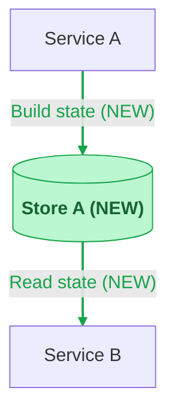

# Mermaid Diagrams

## Source

Build Mermaid from the verified graph produced during code exploration. Keep the terminal and document diagrams on the same nodes and edges.

## Architecture flowchart

- Show 5-10 primary nodes and the main data flow.
- Use `flowchart LR` while readable; use `flowchart TB` with concern/phase subgraphs for wide or long flows.
- Keep node IDs simple. Put punctuation, paths, operation names, and `(NEW)` inside quoted labels.
- Quote edge labels containing punctuation or paths.
- Keep one Mermaid statement per line.
- Put operation detail in sequence diagrams when it makes the overview noisy.

Mark new nodes and edges with `(NEW)` and green styling:

## Sequence diagrams

- Add one diagram for each non-trivial cross-service interaction: multiple hops, asynchronous work, retry, compensation, or meaningful branching.
- One exact operation per arrow. Use RPC method, HTTP method/path, SQL operation/table, cache command/key, or message topic.
- Do not use generic labels such as `call`, `request`, `read`, `write`, `update`, or `process` alone.
- Put conditions in `alt`/`opt` blocks and state transitions in short notes.
- Omit trivial single-hop diagrams.

## Review

- Every drawn edge has code or contract evidence.
- Shared nodes are not duplicated.
- The requested behavior is visible without explanatory prose.
- New and existing behavior are visually distinct.
- Diagram labels contain no information repeated below the diagram.
